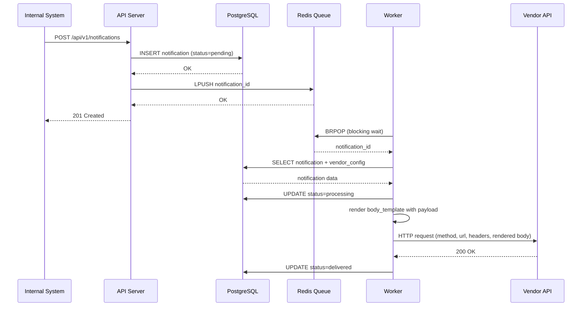
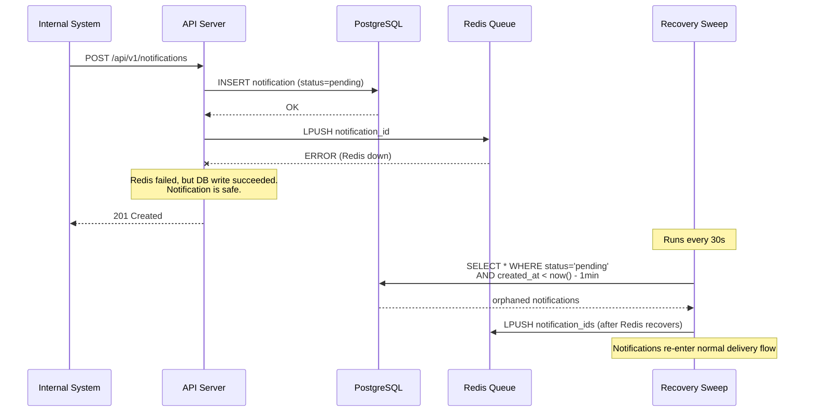
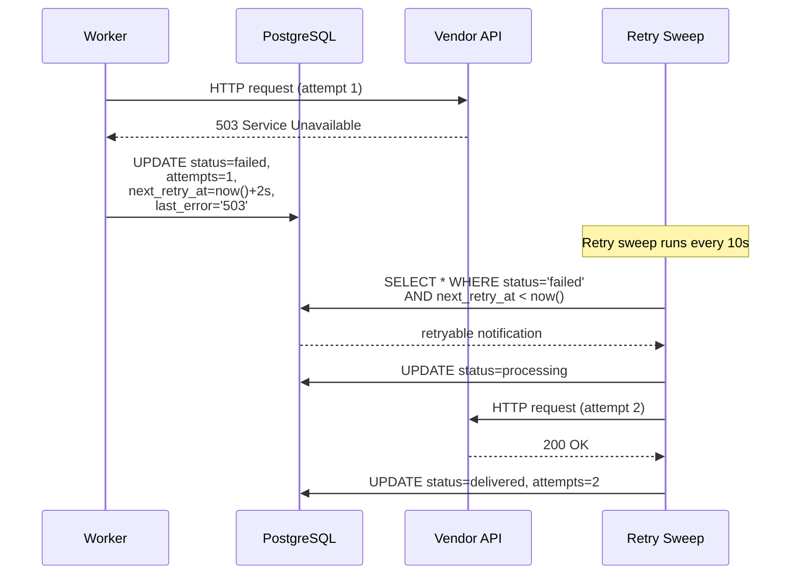
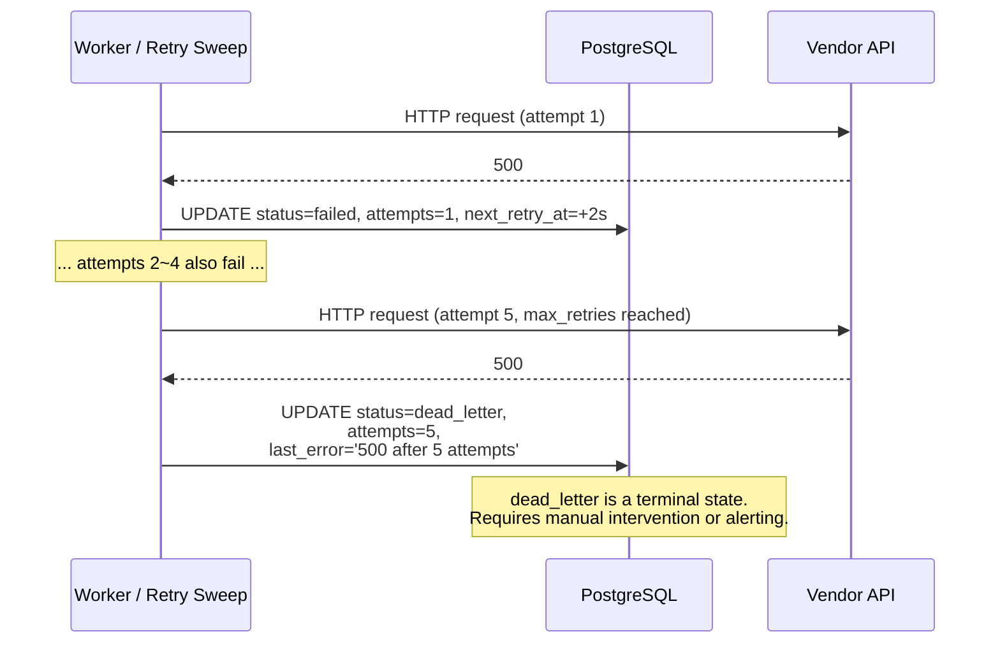
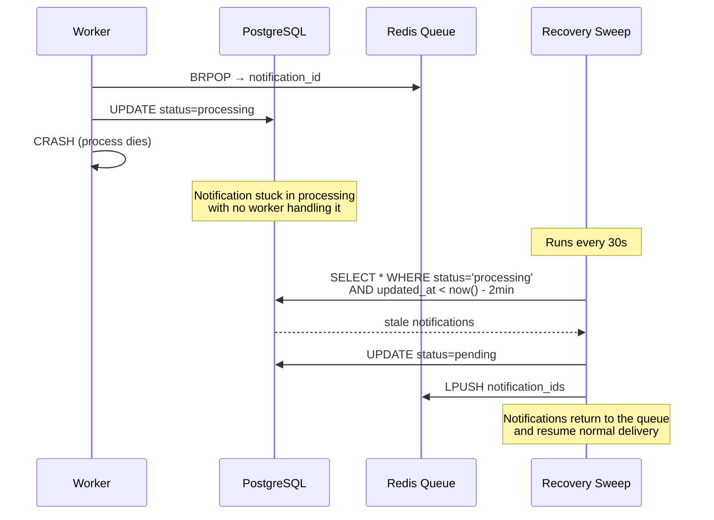
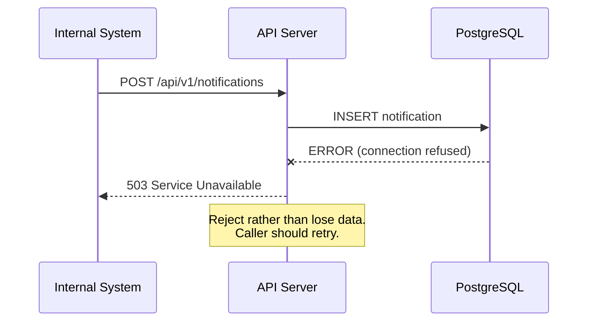
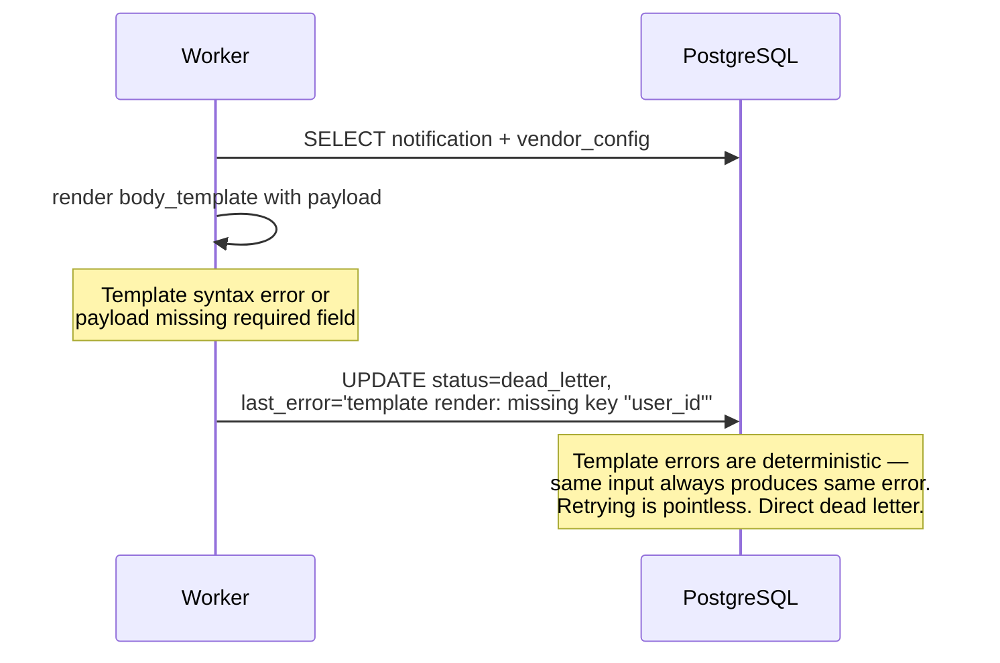
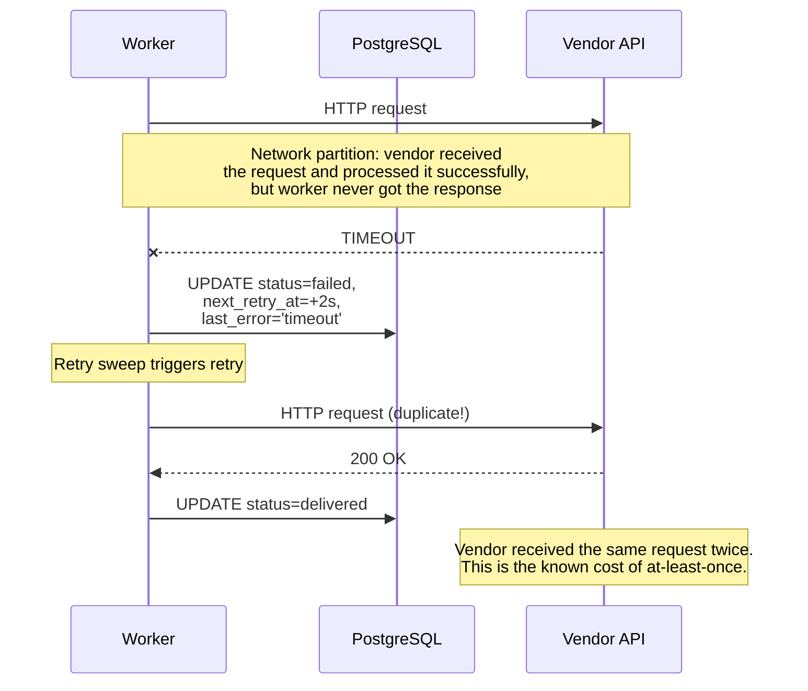

# Notification Delivery Service — Design Document

## Overview

This document describes the design of a Notification Delivery Service — a middleware system that accepts notification requests from internal business systems and reliably delivers them to external vendor HTTP(S) APIs.

Internal systems trigger notifications on business events (user registration, payment, purchase, etc.). Each external vendor has a different API contract (URL, headers, body format). Our service abstracts these differences behind a single internal API and guarantees reliable delivery.

---

## 1. Interaction Flows (Sequence Diagrams)

The following sequence diagrams describe the system from the caller's perspective, covering every normal and abnormal path. This is the entry point for understanding the entire system.

### 1.1 Happy Path: Create Notification → Successful Delivery



Key point: **persist to DB before enqueue, enqueue before returning 201**. By the time the caller receives 201, the data is durable in PostgreSQL.

### 1.2 Failure Path 1: Redis Down



Key point: Redis is a signal channel, not a data store. Even if Redis loses data or goes down entirely, the recovery sweep catches everything from PostgreSQL.

### 1.3 Failure Path 2: Vendor Returns 5xx → Retry → Eventually Succeeds



Retry intervals: `2s → 4s → 8s → 16s → 32s` (exponential backoff + 20% jitter).

### 1.4 Failure Path 3: Vendor Permanently Down → Dead Letter



### 1.5 Failure Path 4: Worker Crash → Recovery Sweep Reclaims



Key point: `updated_at` serves as a heartbeat. If a notification stays in `processing` for more than 2 minutes without an update, the recovery sweep assumes the worker is dead and reclaims it.

### 1.6 Failure Path 5: Database Down → Reject Request



Key point: **no false acknowledgments**. If we cannot persist, we refuse the request. The caller retries on its own. This is the foundation of at-least-once delivery.

### 1.7 Failure Path 6: Template Rendering Failure



Key point: template rendering is a pure function. If it fails once, it will fail every time with the same input. Retrying wastes resources and delays dead-letter visibility. We skip retry and go straight to `dead_letter`.

### 1.8 Failure Path 7: Network Partition → Duplicate Delivery



Key point: this is an inherent trade-off of at-least-once semantics. True exactly-once delivery would require the vendor to support idempotency (accepting and deduplicating on a client-provided idempotency key). We cannot control external APIs, so we accept duplicates as a known cost.

### 1.9 API Overview

| Method | Path | Description |
|--------|------|-------------|
| POST | /api/v1/notifications | Submit a notification |
| GET | /api/v1/notifications/:id | Check delivery status |
| POST | /api/v1/vendors | Create vendor config |
| GET | /api/v1/vendors | List all vendors |
| GET | /api/v1/vendors/:id | Get vendor details |
| PUT | /api/v1/vendors/:id | Update vendor config |
| DELETE | /api/v1/vendors/:id | Delete vendor |
| GET | /healthz | Health check |

---

## 2. System Boundary

### 2.1 What This System Does

This service is **delivery infrastructure**. It solves exactly one problem: given a payload and a target vendor, deliver the payload to that vendor's HTTP API reliably. Specifically:

- **Accepts notification requests** via a REST API from any internal system
- **Persists every request** to PostgreSQL before acknowledging the caller — this is the foundation of "no message loss"
- **Abstracts vendor differences** — each vendor has its own URL, HTTP method, headers, and body format. The calling system does not need to know any of this. It sends a payload and a vendor ID; we handle the rest.
- **Delivers asynchronously** via a worker pool that consumes from a Redis queue. The caller does not wait for the vendor's response.
- **Retries transient failures** with exponential backoff and jitter, respecting per-vendor retry limits
- **Dead-letters permanent failures** so they can be inspected and resolved without blocking other notifications
- **Provides delivery status** so callers can query whether a notification was delivered, is pending, or has failed

### 2.2 What This System Does NOT Do

| Out of Scope | Rationale |
|---|---|
| **Notification content generation** | Business logic belongs in the calling systems. We receive a payload and deliver it — we don't decide what to say. If we generated content, every new business event would require a code change in the delivery service, violating separation of concerns. |
| **Response body processing** | We check HTTP status codes for success/failure, but we don't parse or act on response bodies. The assignment states we don't care about return values. If a future use case requires response handling, it should be a separate service that subscribes to delivery events. |
| **Message ordering guarantees** | Notifications are independent events. Ordering would require per-vendor sequential delivery (single-worker-per-vendor), which dramatically reduces throughput. In our business scenarios (signup events, payment events), there is no causal ordering requirement between different notifications. |
| **Per-vendor rate limiting** | Important for production — a misbehaving internal system could overwhelm a vendor. But rate limiting is a separate concern from reliable delivery. Adding it to the MVP would conflate two problems and increase the surface area for bugs in the core delivery path. Documented as an evolution item (Section 6). |
| **API authentication** | Our API is internal, called by trusted services within the company network. Service-to-service auth (mTLS, API keys, JWT) is an infrastructure concern orthogonal to the delivery problem. Adding it would not demonstrate delivery design, which is the focus of this project. |
| **Multi-tenancy** | Single-tenant MVP. Tenant isolation would require scoping queues, vendor configs, and rate limits per tenant — a meaningful increase in complexity with no benefit for a single-company use case. |

### 2.3 Why These Boundaries

The boundary decision follows a single principle: **this service owns the delivery problem and nothing else**.

Everything upstream (what to send, when to send it) and everything downstream (what the vendor does with it, what the response means) is someone else's responsibility. This keeps the system small enough that we can rigorously reason about its reliability guarantees — which is the actual hard problem.

A common mistake in systems like this is to absorb adjacent concerns (content generation, response routing, business-event orchestration) until the "notification service" becomes an undebuggable monolith. We avoid that by drawing the boundary at the HTTP call: we own everything from "receive a delivery request" to "confirm the vendor got it or give up trying."

---

## 3. Reliability and Failure Handling

### 3.1 Delivery Semantics: At-Least-Once

We guarantee **at-least-once delivery**: every notification will be delivered to the vendor at least once, or moved to a dead-letter state after exhausting retries.

**Why not exactly-once?**

True exactly-once delivery across a distributed system requires **both sides** to cooperate:

1. The sender must tag each request with a unique idempotency key
2. The receiver must persist and deduplicate on that key
3. The acknowledgment path must be atomic with the receiver's processing

Since we call arbitrary external vendor APIs, we cannot assume (2) or (3). We provide an `idempotency_key` field that callers can use for deduplication **on our side** — preventing the same internal system from accidentally submitting the same notification twice. But if a delivery succeeds and our status update fails (e.g., DB write times out after the HTTP call returned 200), we will retry and the vendor will receive a duplicate.

This is a deliberate, documented trade-off. The alternative — marking a notification as delivered optimistically before confirming the vendor's response — risks **under-delivery**, which is worse than over-delivery in our use case. A vendor receiving a duplicate signup event is a minor annoyance; a vendor never receiving a payment event is a business-critical failure.

### 3.2 The Persist-Before-Acknowledge Pattern

The core reliability mechanism: **write to PostgreSQL before returning success to the caller**.

```
1. Caller sends POST /api/v1/notifications
2. Service writes notification to PostgreSQL (status: pending)
3. Service enqueues notification ID to Redis (LPUSH)
4. Service returns 201 Created to caller
```

This ordering is critical. Let's trace what happens if any step fails:

| Failure Point | What Happens | Data Loss? |
|---|---|---|
| Step 2 fails (DB down) | API returns 503 to caller. Nothing is persisted. | No — caller knows it failed and can retry. |
| Step 3 fails (Redis down) | Notification is in DB with `status=pending`. Recovery sweep will enqueue it within 30 seconds. API still returns 201. | No — DB is the source of truth. |
| Crash between step 2 and step 3 | Same as step 3 failure — notification is in DB, recovery sweep will find it. | No. |
| Crash between step 3 and step 4 | Notification is in both DB and Redis. Caller gets a connection error and may retry, but the idempotency key prevents a duplicate DB record. | No. |
| Step 4 succeeds but caller doesn't receive 201 (network issue) | Notification is in DB and Redis. Caller may retry — idempotency key deduplicates. | No. |

The only scenario where data is lost is if the PostgreSQL write itself fails — and in that case, we return an error to the caller (no false acknowledgment). The caller is responsible for retrying.

### 3.3 Failure Mode Deep Dive

All failure modes are illustrated in the sequence diagrams in Section 1.2–1.8. Here we provide the engineering rationale behind each mitigation.

#### 3.3.1 Redis Failure (Diagram 1.2)

**Scenario**: Redis is unreachable when the API server tries to enqueue a notification.

**Mitigation**: The API server still returns 201 because the notification is safely persisted in PostgreSQL. The recovery sweep — a background goroutine running every 30 seconds — queries for notifications in `pending` state with `created_at` older than 1 minute and re-enqueues them.

**Why 1 minute threshold?** A shorter threshold (e.g., 5 seconds) would cause false positives — the sweep would re-enqueue notifications that are already in the Redis queue waiting to be consumed. A longer threshold (e.g., 5 minutes) would increase delivery latency during Redis outages. One minute balances these concerns: it is long enough that normally-processed notifications have already moved to `processing`, and short enough that the delay is acceptable during an outage.

**Why not fail the API request when Redis is down?** Because the caller cannot distinguish "transient Redis failure" from "permanent infrastructure problem." Returning an error would push retry responsibility to every calling system, and each one would need its own retry logic with its own bugs. By accepting the request and relying on the recovery sweep, we centralize the recovery logic in one place.

#### 3.3.2 Vendor Transient Failure (Diagram 1.3)

**Scenario**: The vendor returns a 5xx status code or the connection times out.

**Mitigation**: Exponential backoff retry with jitter. The worker sets `status=failed`, increments `attempts`, computes `next_retry_at`, and records the error in `last_error`. The retry sweep picks it up when `next_retry_at` has passed.

**Retry schedule**: `base * 2^(attempt-1)` where base = 2 seconds, with ±20% jitter and a 10-minute cap.

| Attempt | Base Delay | With Jitter (approx) |
|---------|-----------|----------------------|
| 1 | 2s | 1.6s – 2.4s |
| 2 | 4s | 3.2s – 4.8s |
| 3 | 8s | 6.4s – 9.6s |
| 4 | 16s | 12.8s – 19.2s |
| 5 | 32s | 25.6s – 38.4s |

Total wait before dead-lettering: approximately 50–75 seconds.

**Why jitter?** Without jitter, if a vendor goes down and comes back up, all pending retries for that vendor fire at the same instant (thundering herd). The ±20% jitter spreads them out. This is standard practice from the AWS Architecture Blog's exponential backoff recommendations.

**Why 5 retries by default?** The retry schedule covers roughly 1 minute of outage. This handles transient blips (deploy restarts, brief network issues) without masking persistent problems. Vendors with known flaky APIs can have `max_retries` increased in their config.

#### 3.3.3 Vendor Permanent Failure (Diagram 1.4)

**Scenario**: The vendor is down for an extended period, or consistently returns errors.

**Mitigation**: After `max_retries` attempts are exhausted, the notification moves to `dead_letter` state. This is a terminal state — the system will not automatically retry it.

**Why not retry forever?** Infinite retries create several problems: (1) the retry queue grows unboundedly during an extended outage, consuming DB and Redis resources; (2) notifications delivered hours or days late may be worse than not delivered at all (e.g., a "user just signed up" event delivered 3 days later); (3) an operator has no visibility into the problem because the system silently "handles" it.

Dead-lettering makes the failure **visible and actionable**. In a production system, a dead-letter count metric would trigger an alert, and an operator can inspect the `last_error` to determine whether to fix the vendor config and manually retry, or discard the notifications.

#### 3.3.4 Worker Crash (Diagram 1.5)

**Scenario**: A worker process crashes (OOM kill, panic, hardware failure) while processing a notification.

**Mitigation**: The notification is stuck in `processing` state. The recovery sweep detects notifications in `processing` with `updated_at` older than 2 minutes and moves them back to `pending` for re-delivery.

**Why 2 minutes?** The vendor HTTP timeout defaults to 30 seconds. A normal delivery cycle (read from DB → render template → HTTP call → update DB) takes at most ~35 seconds. A 2-minute threshold gives a generous buffer to avoid reclaiming notifications that are still being actively processed, while still catching genuinely stuck ones within a reasonable window.

**Race condition**: what if the worker is just slow, not dead? If the recovery sweep moves a notification back to `pending` while the original worker is still trying to deliver it, both the original worker and a new worker may deliver the same notification. This is acceptable under at-least-once semantics. The 2-minute buffer makes this unlikely in practice, but we design for the possibility.

#### 3.3.5 Database Failure (Diagram 1.6)

**Scenario**: PostgreSQL is unreachable.

**Mitigation**: The API server returns 503 to callers. Workers pause delivery (they cannot read notifications or update status). No data is lost — we reject new requests rather than accept-and-lose them.

**Why not queue requests in memory until the DB comes back?** In-memory queuing creates an unbounded buffer. If the DB outage lasts long enough, the API server runs out of memory and crashes, losing everything in the buffer. Rejecting requests immediately pushes backpressure to the caller, which is the correct behavior in a distributed system. The caller can retry with its own backoff logic, or buffer requests on its own terms.

#### 3.3.6 Template Rendering Failure (Diagram 1.7)

**Scenario**: The `body_template` references a key that doesn't exist in the payload, or contains invalid template syntax.

**Mitigation**: Direct dead-letter — no retry.

**Why skip retry?** Template rendering is a deterministic, pure function: `f(template, payload) → rendered_body`. If it fails with a given template and payload, it will fail identically on every retry. Retrying wastes compute, delays dead-letter visibility, and occupies a retry slot that could be used for genuinely transient failures. We short-circuit straight to `dead_letter` with a descriptive error message.

#### 3.3.7 Network Partition / Duplicate Delivery (Diagram 1.8)

**Scenario**: The vendor receives and processes our HTTP request, but the response never reaches the worker (network partition, load balancer timeout, etc.).

**Mitigation**: None — this is a known and accepted cost of at-least-once delivery. The worker sees a timeout, marks the notification as `failed`, and the retry sweep delivers it again. The vendor receives a duplicate.

**Why is this acceptable?** In our business scenarios, the downstream systems (ad platforms, CRM, inventory) are designed to handle duplicate events or are naturally idempotent (setting a contact status to "paid" twice has the same effect as setting it once). If a specific vendor cannot tolerate duplicates, the `idempotency_key` can be included in the request body via the `body_template`, giving the vendor a deduplication handle — but enforcing deduplication is the vendor's responsibility, not ours.

### 3.4 State Machine

```
                  ┌──────────────────────────────┐
                  │                              │
                  ▼                              │
pending ──► processing ──► delivered        (retry)
                │                              │
                ▼                              │
             failed ───────────────────────────┘
                │
                ▼  (attempts >= max_retries)
           dead_letter
```

| State | Meaning | Transitions To |
|---|---|---|
| `pending` | Persisted, waiting to be picked up by a worker | `processing` |
| `processing` | A worker is actively delivering this notification | `delivered`, `failed`, `dead_letter` |
| `delivered` | Successfully delivered to the vendor (terminal) | — |
| `failed` | Delivery attempt failed, will be retried | `processing` (via retry sweep) |
| `dead_letter` | All retries exhausted or deterministic failure (terminal) | — |

---

## 4. Architecture

### 4.1 Component Overview

```
┌──────────────┐       ┌───────────┐       ┌──────────────┐
│  Internal     │ POST  │  API      │       │  PostgreSQL  │
│  Systems      │──────►│  Server   │──────►│  (persistence│
│              │       │           │       │   + state)   │
└──────────────┘       └─────┬─────┘       └──────┬───────┘
                             │                     │
                       LPUSH │               SELECT│
                             ▼                     │
                       ┌───────────┐               │
                       │  Redis    │               │
                       │  (queue)  │               │
                       └─────┬─────┘               │
                       BRPOP │                     │
                             ▼                     │
                       ┌───────────┐               │
                       │  Worker   │───────────────┘
                       │  (N       │
                       │  goroutin)│──────► External Vendor APIs
                       └───────────┘
```

### 4.2 Why Two Binaries (API Server + Worker)

The API server and worker are separate binaries (`cmd/server/` and `cmd/worker/`) because they have fundamentally different operational characteristics:

| Dimension | API Server | Worker |
|---|---|---|
| Scaling axis | Request volume (how many internal systems are calling) | Delivery throughput (how many vendor HTTP calls in parallel) |
| CPU profile | Light — validate input, write to DB, push to Redis | Heavy — HTTP calls with TLS handshakes, template rendering |
| Failure impact | Callers get errors, but queued work continues | Delivery pauses, but new requests still accepted |
| Restart cost | Brief unavailability for new submissions | In-flight deliveries may be re-processed (safe under at-least-once) |

By separating them, you can scale workers independently (add more pods/instances) without over-provisioning the API layer, and restart workers without dropping incoming requests.

**What the AI suggested instead**: A single binary with an embedded worker goroutine pool. This is simpler to deploy but violates the scaling separation above. In any real deployment beyond a demo, the API and worker needs diverge quickly.

### 4.3 Why Redis Lists (LPUSH/BRPOP) Over Redis Streams

Redis Streams with consumer groups would provide: message acknowledgment, consumer group load balancing, message replay, and dead-letter handling at the queue level.

We chose simple `LPUSH`/`BRPOP` instead because:

1. **We don't need message replay** — PostgreSQL is our source of truth, not the queue. If we need to re-process notifications, we query the DB, not replay a stream.
2. **We don't need queue-level dead letters** — our dead-letter logic lives in the application layer with richer context (attempt count, error messages, per-vendor config). Redis Streams' dead-letter is just "this message was unacked too long" — it tells you nothing about why.
3. **BRPOP naturally load-balances** across multiple worker instances with no consumer group configuration.
4. **Simpler mental model** — the queue is a lightweight signal that says "there's work to do," not a durable log. This is an important distinction: developers maintaining this system should think of PostgreSQL as the data store and Redis as a notification bell.

The queue stores only notification UUIDs, not full payloads. This keeps the queue lightweight (~36 bytes per message) and avoids data duplication. The worker always reads the full notification from PostgreSQL, which is the single source of truth.

**Trade-off**: if Redis loses data (crash without persistence, or we explicitly run it without AOF/RDB), we lose the "signal" but not the data. The recovery sweep picks up any notifications that fell out of the queue within 30 seconds. This is by design — we intentionally don't rely on Redis durability, which lets us run Redis in a simpler, faster configuration.

### 4.4 Why Raw SQL (pgx) Over an ORM

The queries in this project are straightforward: CRUD operations for vendors and notifications, plus two sweep queries (retry sweep, recovery sweep). An ORM (GORM, ent, sqlc) would add:

- **A dependency with its own abstraction layer** — every query goes through the ORM's query builder, which may generate suboptimal SQL. Debugging "why is this query slow" requires understanding both SQL and the ORM's translation layer.
- **Implicit behavior** — ORMs often introduce lazy loading, automatic timestamps, soft deletes, and implicit transactions. These are convenient until they produce unexpected behavior in a reliability-critical path.
- **Difficulty expressing partial indexes** — the retry sweep and recovery sweep benefit from partial indexes (`WHERE status = 'failed'`, `WHERE status = 'pending'`). These are awkward to define and maintain through an ORM's migration system.

With `pgx` and hand-written SQL, every query is explicit and visible in the repository layer. The sweep queries can be tuned with `EXPLAIN ANALYZE` without an abstraction layer in the way.

### 4.5 Internal Code Architecture

The codebase follows a layered architecture within `internal/`:

```
api (HTTP handlers)
 └── service (business logic)
      └── repository (database queries)
           └── db (connection management)
      └── queue (Redis queue abstraction)
      └── template (body template rendering)
```

Each layer depends only on the layer below it. Handlers are thin — they parse the HTTP request, call a service method, and write the HTTP response. All business logic (validation, state transitions, retry decisions) lives in the service layer. This makes the service layer testable without HTTP or database dependencies.

---

## 5. Vendor Configuration Abstraction

Each vendor is stored in the `vendor_configs` table with:

| Field | Type | Purpose |
|---|---|---|
| `url` | TEXT | The vendor's API endpoint |
| `method` | VARCHAR(10) | HTTP method (POST, PUT, PATCH, etc.) |
| `headers` | JSONB | Static headers sent with every request (auth tokens, content-type, custom headers) |
| `body_template` | TEXT | Go `text/template` string, rendered with the notification payload at delivery time |
| `timeout_ms` | INT | Per-vendor HTTP timeout (default: 30000ms) |
| `max_retries` | INT | Per-vendor retry limit before dead-lettering (default: 5) |

### How Template Rendering Works

The `body_template` receives the notification's `payload` (a JSON object, stored as JSONB in PostgreSQL) as its template context. Callers provide business data as key-value pairs, and the vendor config's template transforms it into the vendor's expected request body format.

**Example**: A CRM vendor expects `{"contact_id": "...", "new_status": "paid"}`, but the calling system sends `{"user_id": "123", "event": "payment"}`. The body template bridges this gap:

```
{"contact_id": "{{.user_id}}", "new_status": "{{.event}}"}
```

If no body template is configured for a vendor, the raw payload JSON is forwarded as-is. This is useful for vendors that accept a generic event payload.

### Why Templates Instead of Code

The alternative is a per-vendor adapter pattern — a Go function for each vendor that constructs the request. Templates win for the MVP because:

1. **No code change required** to onboard a new vendor — create a `vendor_config` row via the API
2. **Non-engineers can modify** body formats (given the template syntax is simple)
3. **Failure is visible** — a bad template produces a clear error ("missing key X") rather than a nil pointer or wrong field mapping buried in adapter code

**Limitation**: Go's `text/template` cannot express complex transformations (conditional fields, array mapping, nested object construction). If a vendor requires this, the template should be upgraded to a more capable engine (e.g., `jsonnet`, `cel-go`), or we add a lightweight plugin/adapter system. This is documented in the evolution path (Section 6).

---

## 6. Trade-offs and Evolution

### 6.1 Key Decisions

| Decision | Alternative Considered | Why This Choice |
|---|---|---|
| **PostgreSQL** for persistence | SQLite | PostgreSQL provides real transaction isolation for concurrent writes from multiple API server and worker instances. SQLite's file-level locking would serialize all writes. PostgreSQL also supports JSONB, partial indexes, and `LISTEN/NOTIFY` — features we use now or may use in the evolution path. |
| **Redis list queue** | In-process goroutine channel | A goroutine channel dies with the process. Redis survives process restarts and can be shared across multiple server/worker instances deployed on different hosts. The operational cost of running Redis is low — it's a single binary with minimal configuration. |
| **Separate server + worker** | Single binary | Independent scaling, independent restarts, clearer failure isolation. A worker crash (e.g., OOM from a vendor returning a huge error response) does not take down the API. See Section 4.2 for the full rationale. |
| **`text/template`** for body rendering | Hardcoded per-vendor adapters | Templates are configurable without code changes or redeployment. Good enough for MVP; acknowledged limitation for complex transformations. See Section 5 for details. |
| **At-least-once** delivery | Exactly-once | True exactly-once requires vendor cooperation (idempotency support). We cannot control external APIs. Under-delivery is a business-critical risk; over-delivery is a tolerable nuisance. See Section 3.1 for the full analysis. |
| **UUID notification IDs** in Redis (not full payload) | Full payload in queue | Keeps Redis lightweight (~36 bytes per message). Avoids data duplication and divergence — PostgreSQL is the single source of truth. Worker always reads from DB, which guarantees it sees the latest state (e.g., if a notification was cancelled between enqueue and delivery). |

### 6.2 What the AI Suggested That I Didn't Adopt

1. **GORM for database access** — The AI initially suggested GORM for faster development. I rejected this because: (a) the queries are simple enough that an ORM adds complexity without reducing it; (b) the sweep queries benefit from hand-tuned partial indexes that would be awkward to express through an ORM; (c) in a reliability-critical system, I want to see every SQL query explicitly — no magic behind the scenes. See Section 4.4.

2. **Redis Streams with consumer groups** — The AI suggested Streams for more robust queue semantics (message ACK, consumer groups, built-in dead-letter). I chose LPUSH/BRPOP because our source of truth is PostgreSQL, not the queue. The queue is a lightweight signal mechanism. The recovery sweep handles the edge cases (Redis data loss, unacked messages) that Streams would solve at the queue layer. Solving them at the application layer gives us richer error context and avoids coupling our reliability to Redis's durability configuration. See Section 4.3.

3. **Single binary with embedded worker** — The AI suggested combining server and worker for simpler deployment. I split them because the API layer and workers have different scaling profiles, failure modes, and resource requirements. A worker pool that's saturated with slow vendor calls should not cause the API to reject new requests. See Section 4.2.

### 6.3 Evolution Path

#### Short-term (next iteration)

- **Per-vendor rate limiting** — Redis token bucket (e.g., `go-redis/redis_rate`) to prevent overwhelming external APIs. This is the most important missing feature for production use. Without it, a burst of notifications for a single vendor could trigger their rate limiter and cause mass failures.
- **Circuit breaker** — Using `sony/gobreaker` or similar. If a vendor fails N consecutive times, stop sending and probe periodically. This prevents wasting resources on a vendor that's clearly down, and reduces the dead-letter flood during extended outages.
- **Prometheus metrics** — Queue depth, delivery latency (p50/p95/p99), failure rate by vendor, dead-letter count, retry sweep lag. These metrics are essential for operating the system — without them, you discover problems from user complaints instead of dashboards.

#### Medium-term

- **Dead-letter management API** — An admin endpoint to list, inspect, and manually retry dead-lettered notifications. Currently, dead-letter recovery requires direct database access, which is not acceptable in production.
- **Webhook signature support** — HMAC signing (e.g., `X-Signature-256` header) for vendors that require request authentication. The signing key would be stored in `vendor_configs` and the signature computed at delivery time.
- **Batch delivery** — Some vendors support bulk endpoints. Group notifications by vendor and send in batches to reduce HTTP overhead and respect rate limits more efficiently.

#### Long-term

- **Replace Redis with a message broker** — If message durability at the queue layer becomes important (e.g., regulatory requirements for audit trails), replace Redis with RabbitMQ or Kafka. The queue interface in `internal/queue/` is already abstracted — the switch would not affect the service or repository layers.
- **Event sourcing for delivery attempts** — Store each delivery attempt as an append-only event (timestamp, status, HTTP status code, response time, error). Currently we only store the latest error in `last_error`. An event log provides a full audit trail and enables analytics (which vendors are slowest, what error patterns emerge).
- **Multi-region deployment** — Geo-aware vendor routing to minimize latency and provide failover. A notification for a US-based vendor should be delivered from a US worker; if that region is down, a EU worker picks it up.

---

## 7. Data Model

### 7.1 notifications table

| Column | Type | Purpose |
|---|---|---|
| id | UUID (PK) | Primary key, generated server-side |
| vendor_id | UUID (FK) | References `vendor_configs.id` |
| payload | JSONB | Arbitrary business data from the caller |
| idempotency_key | VARCHAR(255) | Optional caller-provided deduplication key |
| status | VARCHAR(20) | `pending` / `processing` / `delivered` / `failed` / `dead_letter` |
| attempts | INT | Number of delivery attempts made (starts at 0) |
| next_retry_at | TIMESTAMPTZ | When to retry next (NULL unless `status=failed`) |
| last_error | TEXT | Error message from the most recent failed attempt |
| created_at | TIMESTAMPTZ | When the notification was submitted |
| updated_at | TIMESTAMPTZ | Last status change (used by recovery sweep as a heartbeat) |

### 7.2 vendor_configs table

| Column | Type | Purpose |
|---|---|---|
| id | UUID (PK) | Primary key |
| name | VARCHAR(100) | Human-readable identifier (unique constraint) |
| url | TEXT | Vendor API endpoint |
| method | VARCHAR(10) | HTTP method (POST, PUT, PATCH, etc.) |
| headers | JSONB | Static request headers |
| body_template | TEXT | Go `text/template` string for body rendering |
| timeout_ms | INT | HTTP request timeout in milliseconds (default: 30000) |
| max_retries | INT | Maximum delivery attempts before dead-letter (default: 5) |

### 7.3 Key Indexes

| Index | Definition | Purpose |
|---|---|---|
| `idx_notifications_status` | `(status)` | Speeds up status-based queries (admin dashboard, status API) |
| `idx_notifications_next_retry` | `(status, next_retry_at) WHERE status = 'failed'` | Partial index for the retry sweep — only indexes the rows it needs to scan |
| `idx_notifications_recovery` | `(status, updated_at) WHERE status IN ('pending', 'processing')` | Partial index for the recovery sweep — finds orphaned and stale notifications |
| `idx_notifications_idempotency` | `UNIQUE (vendor_id, idempotency_key) WHERE idempotency_key IS NOT NULL` | Partial unique index for deduplication — only enforced when an idempotency key is provided |

The partial indexes are a deliberate choice over full indexes. In a healthy system, the vast majority of notifications are in `delivered` state. A full index on `status` would be dominated by `delivered` rows that are never queried by the sweeps. Partial indexes keep the index small, fast, and relevant.
