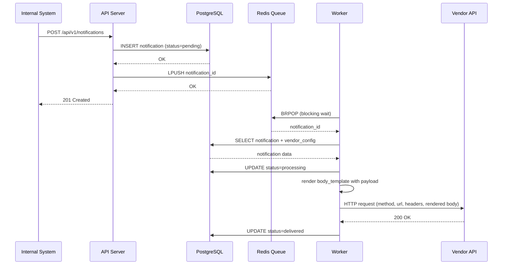
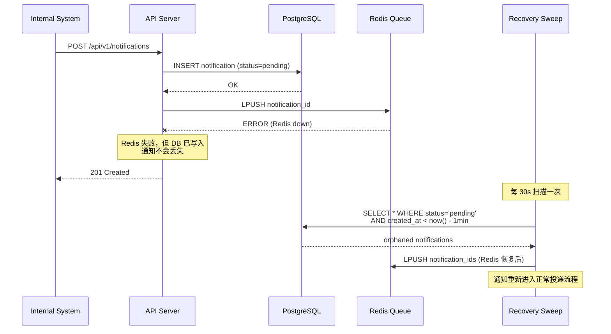
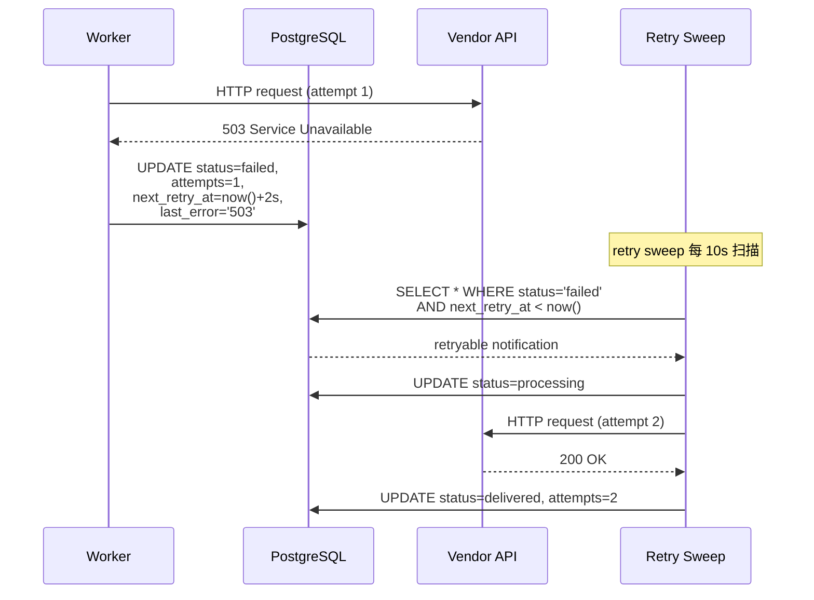
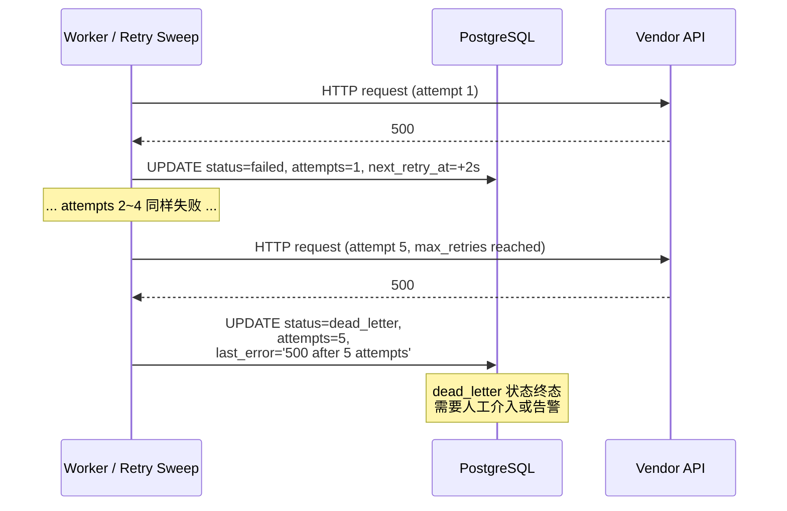
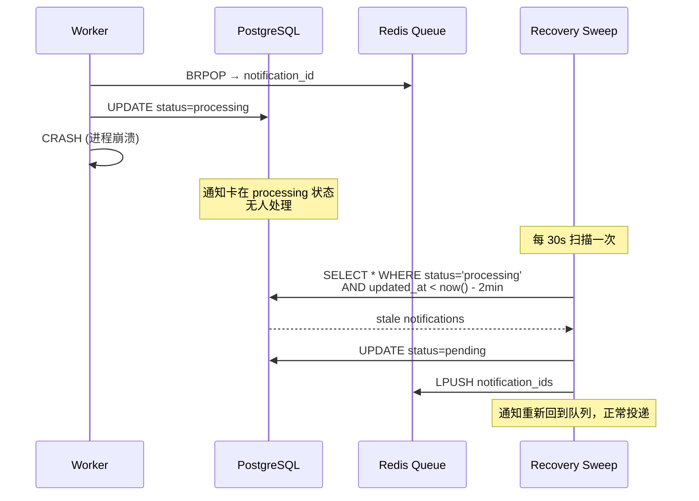
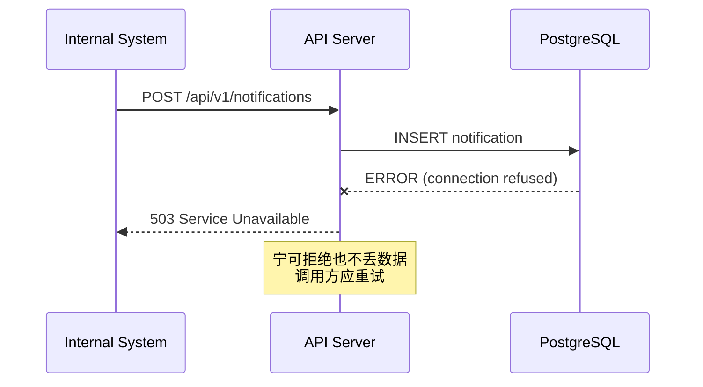
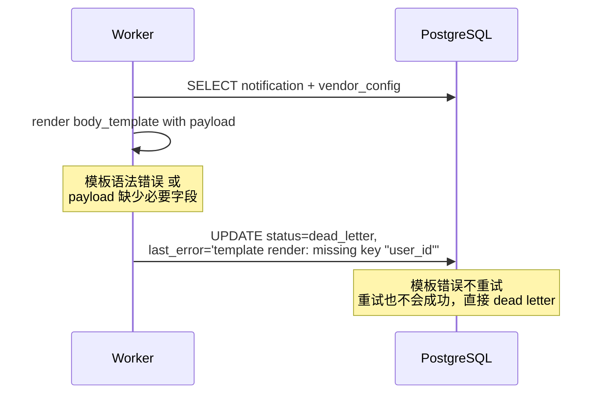
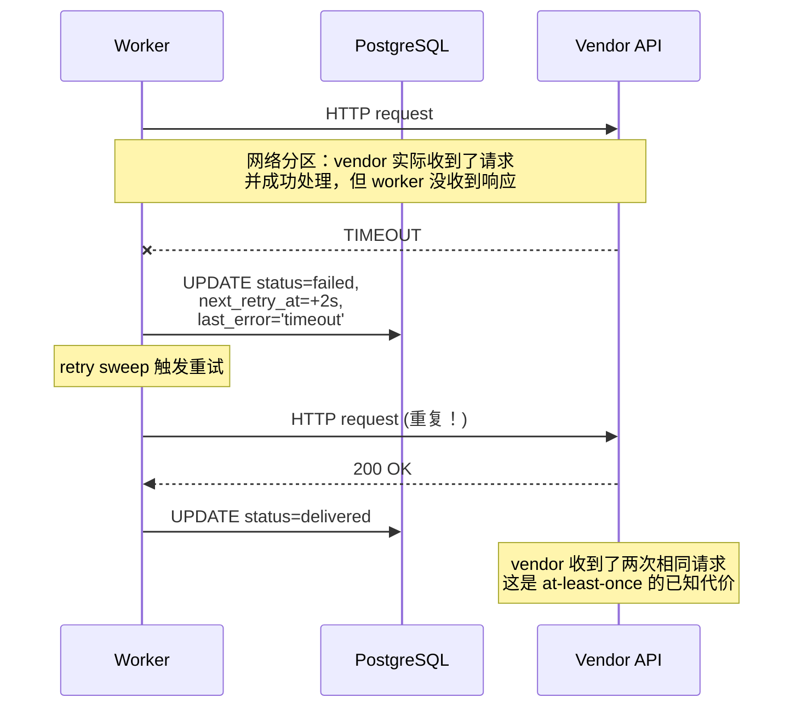

# Notification Delivery Service — Design Document

## Overview

This document describes the design of a Notification Delivery Service — a middleware system that accepts notification requests from internal business systems and reliably delivers them to external vendor HTTP(S) APIs.

Internal systems trigger notifications on business events (user registration, payment, purchase, etc.). Each external vendor has a different API contract (URL, headers, body format). Our service abstracts these differences behind a single internal API and guarantees reliable delivery.

---

## 1. 交互流程（Interface & Sequence Diagrams）

以下泳道图从调用方视角出发，覆盖所有正常和异常路径。这是理解整个系统的入口。

### 1.1 正常路径：创建通知 → 投递成功



关键点：**先写 DB 再入队，再返回 201**。调用方收到 201 时，数据已经持久化。

### 1.2 异常路径 1：Redis 宕机



关键点：Redis 只是信号通道，不是数据源。即使 Redis 丢数据或宕机，recovery sweep 兜底。

### 1.3 异常路径 2：Vendor 返回 5xx → 重试 → 最终成功



重试间隔：`2s → 4s → 8s → 16s → 32s`（指数退避 + 20% jitter）。

### 1.4 异常路径 3：Vendor 持续失败 → Dead Letter



### 1.5 异常路径 4：Worker 崩溃 → Recovery Sweep 回收



关键点：用 `updated_at` 超时判断 worker 是否已失联，2 分钟无更新视为卡死。

### 1.6 异常路径 5：DB 宕机 → 拒绝请求



关键点：**不做假确认**。DB 写不进去就直接报错，调用方自行重试。这是 at-least-once 的基石。

### 1.7 异常路径 6：模板渲染失败



关键点：模板渲染是确定性操作——同样的输入永远产生同样的错误，重试没有意义，直接进 dead letter。

### 1.8 异常路径 7：网络分区 → 重复投递



关键点：这是 at-least-once 语义下不可避免的代价。真正的 exactly-once 需要 vendor 侧支持幂等（接受 idempotency key 并去重），我们无法控制外部 API。

### 1.9 接口总览

| Method | Path | Description |
|--------|------|-------------|
| POST | /api/v1/notifications | 提交通知 |
| GET | /api/v1/notifications/:id | 查询投递状态 |
| POST | /api/v1/vendors | 创建 vendor 配置 |
| GET | /api/v1/vendors | 列出所有 vendor |
| GET | /api/v1/vendors/:id | 查询 vendor 详情 |
| PUT | /api/v1/vendors/:id | 更新 vendor 配置 |
| DELETE | /api/v1/vendors/:id | 删除 vendor |
| GET | /healthz | 健康检查 |

---

## 2. System Boundary

### What This System Does

- Accepts notification requests via a REST API
- Persists every request to PostgreSQL before acknowledging
- Asynchronously delivers notifications to external vendor APIs
- Retries failed deliveries with exponential backoff
- Moves permanently failed notifications to a dead-letter state for manual inspection
- Provides status queries so callers can check delivery outcomes

### What This System Does NOT Do

| Out of Scope | Rationale |
|---|---|
| Notification content generation | Business logic belongs in the calling systems. We receive a payload and deliver it — we don't decide what to say. |
| Response processing | We check HTTP status codes for success/failure, but we don't parse or act on response bodies. The assignment states we don't care about return values. |
| Message ordering | Notifications are independent events. Ordering would require per-vendor sequential delivery, which dramatically reduces throughput for no business benefit in this use case. |
| Rate limiting per vendor | Important for production, but a separate concern. Adding it to the MVP would conflate delivery reliability with traffic shaping. Documented as an evolution item. |
| Authentication on our API | Internal service-to-service auth (mTLS, API keys) is an infrastructure concern orthogonal to the delivery problem. |
| Multi-tenancy | Single-tenant MVP. Tenant isolation would require scoping queues and configs per tenant. |

### Why These Boundaries

The core insight is that this service is **delivery infrastructure**, not business logic. It answers one question: "given a payload and a vendor, deliver it reliably." Everything else — what to send, when to send it, what the response means — belongs elsewhere.

This boundary keeps the system simple enough to reason about its reliability guarantees, which is the actual hard problem.

---

## 3. Reliability and Failure Handling

### Delivery Semantics: At-Least-Once

We guarantee **at-least-once delivery**. Every notification will be delivered to the vendor at least once, or moved to a dead-letter state after exhausting retries.

**Why not exactly-once?** True exactly-once delivery across distributed systems requires the receiving end to support idempotency (e.g., accept and deduplicate on a client-provided idempotency key). Since we're calling arbitrary external vendor APIs, we cannot assume they support this. We provide an `idempotency_key` field that callers can use for deduplication on *our* side (preventing duplicate submissions), but the vendor may still receive duplicates if a delivery succeeds but our status update fails.

### The Persist-Before-Acknowledge Pattern

The core reliability mechanism: **write to the database before returning success to the caller**. See 1.1 正常路径 for the complete sequence.

The only way to lose a notification is if the database write itself fails, in which case we return an error to the caller (no false acknowledgment). See 1.6 DB 宕机 for this case.

### Failure Mode Summary

All failure modes have been illustrated in the sequence diagrams above (Section 1.2–1.8). Here is a quick reference:

| Failure | Diagram | Mitigation |
|---|---|---|
| Redis down | 1.2 | Recovery sweep re-enqueues from DB |
| Vendor 5xx | 1.3 | Exponential backoff retry |
| Vendor permanently down | 1.4 | Dead letter after max retries |
| Worker crash | 1.5 | Recovery sweep reclaims stale `processing` |
| Database down | 1.6 | API rejects request — no false ACK |
| Template render error | 1.7 | Direct dead letter — no retry |
| Network partition | 1.8 | At-least-once duplicate — by design |

### Retry Design

- **Exponential backoff**: `base * 2^(attempt-1)` where base = 2 seconds
- **Jitter**: ±20% to avoid thundering herd when multiple notifications fail simultaneously
- **Cap**: 10 minutes maximum delay between retries
- **Default max retries**: 5 (configurable per vendor)
- **Retry schedule** (approximate): 2s, 4s, 8s, 16s, 32s — total wait ~62 seconds before dead-lettering

The retry sweep runs every 10 seconds, polling for `failed` notifications whose `next_retry_at` has passed.

### State Machine

```
                  ┌──────────────────────────────┐
                  │                              │
                  ▼                              │
pending ──► processing ──► delivered        (retry)
                │                              │
                ▼                              │
             failed ───────────────────────────┘
                │
                ▼  (attempts >= max_retries)
           dead_letter
```

---

## 4. Architecture

### Components

```
┌──────────────┐       ┌───────────┐       ┌──────────────┐
│  Internal     │ POST  │  API      │       │  PostgreSQL  │
│  Systems      │──────►│  Server   │──────►│  (persistence│
│              │       │           │       │   + state)   │
└──────────────┘       └─────┬─────┘       └──────┬───────┘
                             │                     │
                       LPUSH │               SELECT│
                             ▼                     │
                       ┌───────────┐               │
                       │  Redis    │               │
                       │  (queue)  │               │
                       └─────┬─────┘               │
                       BRPOP │                     │
                             ▼                     │
                       ┌───────────┐               │
                       │  Worker   │───────────────┘
                       │  (N       │
                       │  goroutin)│──────► External Vendor APIs
                       └───────────┘
```

### Why Two Binaries

The API server and worker are separate binaries because they have different scaling profiles. Under high load, you may need more workers (CPU-bound on HTTP calls to vendors) while the API server stays light (just a DB write and queue push). Separate binaries also mean you can restart workers without dropping incoming requests.

### Why Redis Lists Over Redis Streams

Redis Streams with consumer groups would provide: message acknowledgment, consumer group load balancing, message replay, and dead-letter handling at the queue level.

I chose simple `LPUSH`/`BRPOP` instead because:

1. **We don't need message replay** — the database is our source of truth, not the queue
2. **We don't need queue-level dead letters** — our dead-letter logic is in the application layer with richer context (attempt count, error messages, per-vendor config)
3. **BRPOP naturally load-balances** across multiple workers
4. **Simpler mental model** — the queue is just a signal that says "there's work to do," not a durable log

The queue stores only notification UUIDs, not full payloads. This keeps the queue lightweight and avoids data duplication — PostgreSQL remains the single source of truth.

**Trade-off**: If Redis loses data (crash without persistence), we lose the "signal" but not the data. The recovery sweep picks up any notifications that fell out of the queue within 30 seconds.

### Why Raw SQL Over an ORM

The queries in this project are straightforward CRUD plus two sweep queries. An ORM (GORM, ent) would add:
- A dependency with its own learning curve
- Magic behavior (lazy loading, implicit transactions) that obscures what SQL actually runs
- Potential N+1 query issues in the sweep paths

With `pgx` and hand-written SQL, every query is explicit and the sweep queries can be optimized with partial indexes without fighting the ORM's query builder.

---

## 5. Vendor Configuration Abstraction

Each vendor is configured with:

| Field | Purpose |
|---|---|
| `url` | The vendor's API endpoint |
| `method` | HTTP method (POST, PUT, etc.) |
| `headers` | Static headers (auth tokens, content type) as JSON |
| `body_template` | Go `text/template` string rendered with the notification payload |
| `timeout_ms` | Per-vendor HTTP timeout |
| `max_retries` | Per-vendor retry limit |

The body template receives the notification's `payload` (a JSON object) as its template context. This means callers provide business data as key-value pairs, and the vendor config transforms it into the vendor's expected format.

Example: a CRM vendor expects `{"contact_id": "...", "new_status": "paid"}` while the caller sends `{"user_id": "123", "event": "payment"}`. The body template bridges this:

```
{"contact_id": "{{.user_id}}", "new_status": "{{.event}}"}
```

If no body template is configured, the raw payload JSON is sent as-is.

---

## 6. Trade-offs and Evolution

### Decisions Made

| Decision | Alternative Considered | Why I Chose This |
|---|---|---|
| PostgreSQL for persistence | SQLite | PostgreSQL is closer to production reality. Concurrent writes from API + workers need real transaction isolation. |
| Redis list queue | In-process goroutine channel | A channel dies with the process. Redis survives restarts and can be shared across multiple server/worker instances. |
| Separate server + worker binaries | Single binary with embedded worker | Independent scaling, independent restarts, clearer separation of concerns. |
| `text/template` for body rendering | Hardcoded per-vendor logic | Templates are configurable without code changes. Good enough for MVP; could upgrade to a more capable engine later. |
| At-least-once delivery | Exactly-once | True exactly-once requires vendor cooperation (idempotency support). We can't control external APIs. |

### What AI Suggested That I Didn't Adopt

1. **GORM for database access** — AI initially suggested using GORM. I rejected this because the queries are simple enough that an ORM adds complexity without reducing it. The sweep queries benefit from hand-tuned partial indexes that would be awkward to express through an ORM.

2. **Redis Streams with consumer groups** — AI suggested Streams for more robust queue semantics. I chose the simpler LPUSH/BRPOP pattern because our source of truth is PostgreSQL, not the queue. The queue is a lightweight signal mechanism, and the recovery sweep handles the edge cases that Streams would solve at the queue layer.

3. **Embedding the worker in the server binary** — AI suggested a single binary for simplicity. I split them because in any real deployment, the API layer and workers have different scaling needs and different failure modes. A worker crash shouldn't affect API availability.

### Evolution Path

**Short-term additions** (next iteration):
- Per-vendor rate limiting using a Redis token bucket — prevents overwhelming external APIs
- Circuit breaker pattern (e.g., `gobreaker`) — stop sending to a vendor that's been failing consistently, probe periodically
- Prometheus metrics — queue depth, delivery latency p50/p95/p99, failure rate by vendor, dead-letter count

**Medium-term**:
- Admin API/dashboard for dead-letter inspection and manual retry
- Webhook signature support (HMAC signing) for vendors that require request authentication
- Batch delivery — some vendors support bulk endpoints; group notifications and send in batches

**Long-term**:
- Replace Redis with RabbitMQ or Kafka if message durability at the queue layer becomes important
- Event sourcing — store delivery attempts as an append-only log for full audit trail
- Multi-region deployment with geo-aware vendor routing

---

## 7. Data Model

### notifications table

| Column | Type | Purpose |
|---|---|---|
| id | UUID | Primary key |
| vendor_id | UUID | Foreign key to vendor_configs |
| payload | JSONB | Arbitrary business data from caller |
| idempotency_key | VARCHAR(255) | Optional caller-provided dedup key |
| status | VARCHAR(20) | pending / processing / delivered / failed / dead_letter |
| attempts | INT | Number of delivery attempts made |
| next_retry_at | TIMESTAMPTZ | When to retry (null if not failed) |
| last_error | TEXT | Last delivery error message |
| created_at | TIMESTAMPTZ | When the notification was submitted |
| updated_at | TIMESTAMPTZ | Last status change |

### vendor_configs table

| Column | Type | Purpose |
|---|---|---|
| id | UUID | Primary key |
| name | VARCHAR(100) | Human-readable identifier (unique) |
| url | TEXT | Vendor API endpoint |
| method | VARCHAR(10) | HTTP method |
| headers | JSONB | Static request headers |
| body_template | TEXT | Go text/template for body rendering |
| timeout_ms | INT | HTTP request timeout |
| max_retries | INT | Max delivery attempts before dead-letter |

### Key Indexes

- `idx_notifications_status` — speeds up status-based queries
- `idx_notifications_next_retry` — partial index on `(status, next_retry_at) WHERE status = 'failed'` for the retry sweep
- `idx_notifications_idempotency` — partial unique index on `(vendor_id, idempotency_key) WHERE idempotency_key IS NOT NULL` for deduplication
